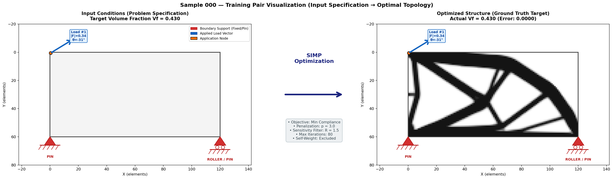

# Real-Time Structural Topology Optimization via Deep Learning

[](https://www.python.org/downloads/)
[](https://opensource.org/licenses/MIT)

A high-performance pipeline for generating structural topology optimization datasets using the **Solid Isotropic Material with Penalization (SIMP)** method, tailored for training deep learning models (e.g., U-Net) to predict optimal topologies in real-time (< 10 ms).



---

## Overview

Traditional Topology Optimization (SIMP) iteratively solves large finite element systems ($\mathbf{K} \mathbf{U} = \mathbf{F}$) 50–100 times per design, taking minutes to converge. This project builds a deep learning foundation to predict structural density distributions directly from:
- Boundary conditions (fixed $X$ and $Y$ displacements)
- Point loads (magnitude and angle)
- Target volume fractions ($V_f$)

### Key Highlights
- **Domain Size:** $60 \times 120$ bilinear quadrilateral element grid ($Q_4$), 14,762 degrees of freedom.
- **Physics-Informed Poisson Fixture Sampling:** Discrete Poisson point supports ($N_x \sim \text{Poisson}(2)$, $N_y \sim \text{Poisson}(1)$, $N_L \sim \text{Poisson}(1)$ with boundary bias) physically driving the optimizer toward slender, triangulated Michell truss bars with internal voids rather than trivial solid blocks.
- **Optimized FEA Solver:** Correct $Q_4$ degree-of-freedom ordering, sparse matrix pre-assembly, and Sigmund/Bourdin mesh-independency sensitivity filtering precomputed in shared memory.
- **Multi-Core High-Throughput Generator:** Parallelized SIMP generation utilizing Python `multiprocessing`.

---

## Repository Structure

```
topo_opto/
├── dataset_generator.py     # Production SIMP dataset generation engine with multiprocessing
├── visualize_data.py        # 3-panel engineering visualizer (BCs, loads, and final density)
├── handover.md              # In-depth technical reference and mathematical derivations
├── topo_opti_project.pdf    # Project and course specification document
├── images/
│   └── sample_000.png       # Sample engineering visualization output
└── .gitignore               # Ignored cache files, checkpoints, and data archives
```

---

## Quickstart

### Prerequisites

Install dependencies:
```bash
pip install numpy scipy matplotlib torch
```

### 1. Generate Dataset

Generate SIMP samples using multi-core parallelization:
```bash
python dataset_generator.py --num_samples 2000 --output topo_dataset.npz --cores 8
```

### 2. Visualize Samples

Inspect generated samples with boundary conditions, load vectors, and density fields:
```bash
python visualize_data.py --dataset topo_dataset.npz --num_visualizations 5 --output_dir images
```

---

## Detailed Documentation

For full mathematical formulations, FEA derivations, benchmarking results, and Phase 2 deep learning architecture plans, refer to [`handover.md`](handover.md).

---

## Author

- **Vedant Gupta** ([Vedantgupta070@gmail.com](mailto:Vedantgupta070@gmail.com))
- GitHub: [@wiesard-g12](https://github.com/wiesard-g12)
